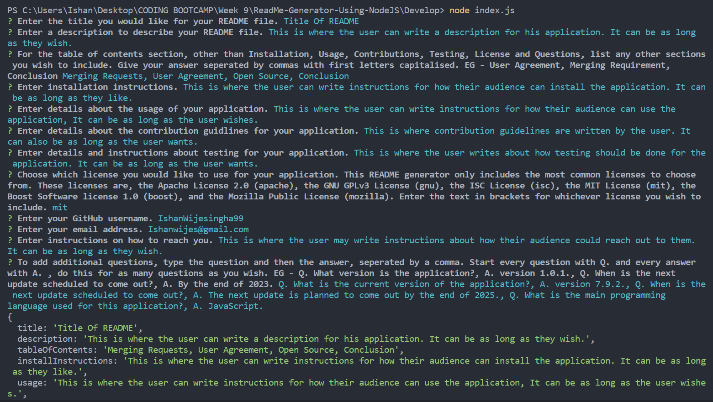
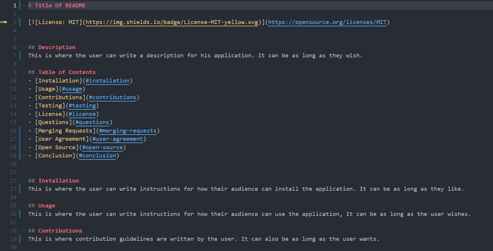
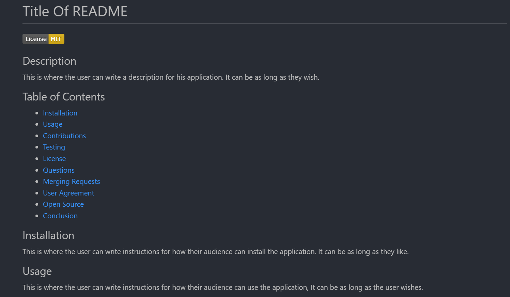

# Professional README Generator Starter Code

## Description
This is a command-line application that generates a README file based on user input. The user will be asked a series of questions, and based off those, the README file will be created. This application is invoked by entering the 'Develop' directory and entering the command 'node index.js' in the terminal.

## Screenshots of Application

## Link to Video
https://screenrec.com/share/LRFk0xePDV

